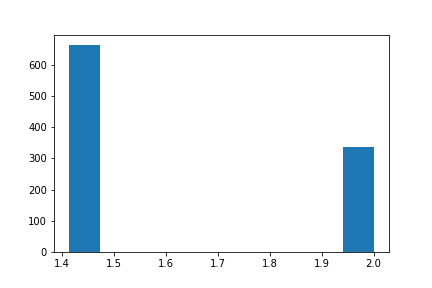
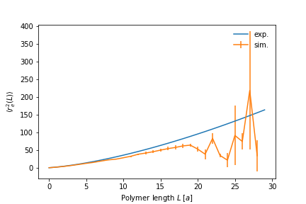

# Weekly progress journal

## Instructions

In this journal you will document your progress of the project, making use of the weekly milestones.

Every week you should 

1. write down **on the day of the lecture** a short plan (bullet list is sufficient) of how you want to 
   reach the weekly milestones. Think about how to distribute work in the group, 
   what pieces of code functionality need to be implemented.
2. write about your progress **until Monday, 23:59** before the next lecture with respect to the milestones.
   Substantiate your progress with links to code, pictures or test results. Reflect on the
   relation to your original plan.

We will give feedback on your progress on Tuesday before the following lecture. Consult the 
[grading scheme](https://computationalphysics.quantumtinkerer.tudelft.nl/proj1-moldyn-grading/) 
for details how the journal enters your grade.

Note that the file format of the journal is *markdown*. This is a flexible and easy method of 
converting text to HTML. 
Documentation of the syntax of markdown can be found 
[here](https://docs.gitlab.com/ee/user/markdown.html#gfm-extends-standard-markdown). 
You will find how to include [links](https://docs.gitlab.com/ee/user/markdown.html#links) and 
[images](https://docs.gitlab.com/ee/user/markdown.html#images) particularly.

## Week 1
(due 18 April 2022, 23:59)
The task of week 1 was:  Start to implement a basic simulation of polymers using the Rosenbluth algorithm, explain the weights entering the simulation, and make plans how to validate your code.

We split this into several sub-milestones:
1: Code a method of initialising and storing polymers
2: Visualise the polymers
3: Write a function to randomly grow a polymer to a desired size
4: Verify if the polymers grow as expected

These tasks were performed the following way;
Task 1: Monomer and Polymer classes were implemented in the core_func.py file to initialise Polymers and extract basic information, such as the chain length, end to end length, and location of the polymer. 
Task 2: The function plot_polymer was added to the data_funcs.py file to visualise a polymer
Task 3: The functions grow_polymer and find_polymer were added to the data_funcs.py file in order to grow and find a random polymer of a specified length. Grow_polymer also stores the amount of growth option a polymer has at each growth step in order to calculate the weight of the polymer for when we start sampling them.
Task 4: In simulation.ipnb the implemented functions were tested. This included growing 1000 random polymers in order to verify the distribution of end 2 end distances of the polymers. The result of these distributions are given in the figures below for polymers of lengths 2 and 3 for which we can easily identify the correctness by hand.

 

These distributions are as expected, randomly growing of polymers seems to be fine.

## Week 2
(due 25 April 2022, 23:59)
This week we have the task of performing simulations and validating the results. To this end we need to: 1. Create and store a data-set of polymers of a desired length. 2. Extract information from the polymers and compute an observable. 3. Compare the results of this observable to expected behaviour.

For the first task a new class Dish was implemented in the core_func.py file. This class initializes a petry dish environment in which we can grow and store a data-set of N polymers of length L.

The end-to-end distance was chosen as the observable of interest, by keeping track of the weights of the polymers at each growth step we are able to calculate the average end-to-end distance as a function of the polymer length, from a single simulation, by computation of the weigthed sum, equation (2) in the lecture notes.

The end-to-end distance is know to obey a scalling law proportional to L to the power 3/2. We computed the end-to-end distance as a function of polymer length using a data-set of 100 polymers of length 30.

We see that for short lengths the end-to-end distance closely follows the expected scaling law, however as the length increase so does the uncertainity in our results and the observed average starts to deviate from the expected behaviour. As noted in the lecture notes one of the problems with the Rosenbluth method is that for the longer polymers there are few weights dominating the average which in turn enhances the error in the results. This problem is to be addressed next week through implementation of the PERM algorithm.

## Week 3
(due 2 May 2022, 23:59)

